# viki

---
# 1. Introduction
## 1.1. Purpose

This document describes the `viki` CLI application that manages servers using a declarative configuration file.

## 1.2. Audience

The audience for this document includes:

* Developer who will develop the application, run unit tests, configure build tools and write user documentation.

* DevSecOps Engineer who will shape the workflow, and write playbooks and runbooks.

---
# 2. System Overview
## 2.1. Benefits and Values

1. Currently, configuration management tools are limited to bash scripts or Ansible, which may not guarantee idempotency. Ansible requires a YAML configuration file that is preprocessed with Jinja syntax, which adds a layer of complexity.

2. The `viki` CLI application is a configuration management tool that ensures idempotency and uses a JSON state file and YAML configuration files.

3. The `viki` CLI application allows the DevSecOps to create a YAML configuration file that specifies the desired outcome for a server, and stores the current state in a JSON state file.

4. The `viki` CLI application allows the Developer to manage command modules, without editing the Python code, by using dictionary constants `DATA_COMMAND` and `MODS_COMMAND`.
  * `DATA_COMMAND` is defined as a JSON object with `<MOD>` and `<CMD>` pairs.
  * `MODS_COMMAND` is defined as a JSON object with `<MOD>` and `{ "insert": "<CMD>", "remove", "<CMD>" }` pairs.

5. The `viki` CLI application supports `sudo` command with both password and passwordless authentication. When `sudo_password` is set to a non-empty string value, password authentication is used instead of passwordless.

## 2.2. Limitations

This project has several limitations.

* No dependencies between modules and instances of modules.
* You cannot perform an `update` to your resource.
  * You should `destroy` your current resource and `add` a new one.
* No priority when resources are created or destroyed during the `apply` stage.
  * A workaround is to create your configuration files in order, e.g. `01.vk.yaml`, `02.vk.yaml`, and to remove them in the reverse order.
* No support for local server.
  * TODO: When `hostname` is set to `localhost`, the commands will be applied to the current workstation.

## 2.3. Workflow

This project uses several methods and products to optimize your workflow.

* Use a version control system (**GitHub**) to track your changes and collaborate with others.
* Use a diagram as code tool (**Mermaid**) to draw any system design or diagram.
* Use a build tool (**Makefile**) to automate your build tasks.
* Use a package manager (**pipenv**) to manage your dependencies.
* Use a testing framework (**pytest**) to automate your testing.
* Use a linter (**check-jsonschema**) to lint the rules YAML file.
* Use a containerization platform (**Docker**) to run your application in any environment.

## 2.4. Security

This project has the following security.

* The `viki` CLI application allows sensitive values to be stored as environment variables with prefix `VK_VAR_`.
  * A `<var_name>` associated with an environment variable `VK_VAR_<var_name>` will use that value.


## 2.5. `viki` CLI Application

The `viki` CLI application has several commands:
  * A `fetch` command retrieves the outputs of data modules from a server and updates the JSON state file.
  * A `plan` command compares the configuration to the current state and outputs any changes that are required.
  * An `apply` command applies the changes from a `plan` stage to a server and updates the JSON state file.
  * A `list` command shows all managed resources in a state file.

```mermaid
%%{ init: { 'theme': 'dark' } }%%
gantt
    title Run viki CLI Application commands
    dateFormat x
    axisFormat %L

    section viki.py
    CliRequest                          : crit, 0, 360ms
    __init__                            : code1, 0, 55ms
    load_state                          : code2, 0, 15ms
    load_config                         : code3, after code2, 20ms
    check_schema                        : code4, after code3, 20ms
    VkVariable.load_os                  : code5, after code1, 30ms

    section apply
    CliApply                            : crit, apply1, after data1, 205ms
    CliFetch.__init__                   : apply2, after plan5, 20ms
    approval                            : apply3, after apply2, 15ms
    apply_insert                        : apply4, after apply3, 20ms
    apply_remove                        : apply5, after apply4, 20ms
    CliRequest.write_state              : apply6, after apply5, 40ms

    section plan
    CliPlan                             : crit, plan1, after data1, 85ms
    check_which                         : plan2, after data1, 20ms
    __delta_insert                      : plan3, after plan2, 25ms
    __delta_remove                      : plan4, after plan3, 25ms
    __delta_count                       : plan5, after plan4, 20ms

    section fetch
    CliFetch                            : crit, data1, after code5, 70ms
    check_which                         : data2, after code5, 20ms
    fetch                               : data3, after data2, 10ms
    CliRequest.write_state              : data4, after data3, 40ms
```

    * `viki.vars.<var_name>`
    * `viki.mods.<mod_name>.<instance_name>`
    * `viki.data.<mod_name>.<instance_name>`
  * A `show <fully_qualified_instance_name>` command shows a managed instance in a state file.



---
# 3. User Personas
## 3.1 RACI Matrix

|            Category            |                              Activity                              | Developer | DevSecOps |
|:------------------------------:|:------------------------------------------------------------------:|:---------:|:---------:|
| Installation and Configuration |                [Create the project structure][i01]                 |    R,A    |           |
| Installation and Configuration |                     [Create a `Makefile`][i02]                     |    R,A    |           |
| Installation and Configuration | [Use `check-jsonschema` to validate your configuration files][i03] |           |    R,A    |

[i01]: #51-create-the-project-structure
[i02]: #52-create-a-makefile
[i03]: #53-use-check-jsonschema-to-validate-your-configuration-files

---
# 4. Requirements
## 4.1. Local workstation

- `check-jsonschema` version 0.26.1 (`python3 -m pip install`)
- Python 3.11.9 (`pipenv shell --python 3.11`)
  - `paramiko==3.4.0` (`pipenv install`)
  - `pyyaml==6.0.1` (`pipenv install`)
  - `pytest==8.2.2` (`pipenv install --dev`)
- Visual Studio Code

---
# 5. Installation and Configuration
## 5.1. Create the project structure

This runbook should be performed by the Developer.

<details><summary>Click here to Create the project structure.</strong></summary>

1. Create a new directory structure for your project with the following subdirectories and files.

```sh
viki/
|- .gitignore
|- README.md
+- app/
   |- .env
   |- viki.py
   |- Makefile
   |- Pipfile
   +- tests/
      |- conftest.py
   +- common/
      |- __init__.py
```

</details>

## 5.2. Create a `Makefile`

This runbook should be performed by the Developer.

<details><summary>Click here to create a Makefile.</strong></summary>

1. Create a new file `app/Makefile`.

```Makefile
.PHONY: default install_new apply fetch plan shell_clean test test_verbose

default: test

install_new:
	pipenv install paramiko==3.4.0 pyyaml==6.0.1
	pipenv install --dev pytest==8.2.2

apply:
	python viki.py -p $(DIR) apply

fetch:
	python viki.py -p $(DIR) fetch

plan:
	python viki.py -p $(DIR) plan

shell_clean:
	pipenv --rm

test:
	PYTHONPATH=.:../ pytest

test_verbose:
	PYTHONPATH=.:../ pytest -v -s
```

</details>

## 5.3. Use `check-jsonschema` to validate your configuration files

This runbook should be performed by the DevSecOps.

The `app/schema.json` supports the following schema in a YAML configuration file. (Bold **`key`** means required):
* `viki`: info for `viki` configuration
  * `vars`: info for variables
    * **`hostname`**: IP address of server (`string`)
    * **`username`**: username (`string`)
    * **`password`**: password (`string`)
    * **`sudo_password`**: sudo password (`string`)
    * `<var_name>`: value (one of `<var_type>`: [`number`, `string`, `list`, `map`])

  > Note: `<var_name>` associated with environment variables with prefix `VK_VAR_<var_name>` will use those values.

  * `data`: info for read-only modules.
    * `ls`: list a directory on a server.
      * `<data_name>`: instance name of data module.
        * `<data_param>`: map of instance parameters.
  * `mods`: info for read-write modules.
    * `wget`: download a file with `https`.
      * `<mod_name>`: instance name of module.
        * `<mod_param>`: map of instance parameters.

  > Note: Each `data` and `mods` have parameters that are specific for that module.

<details><summary>Click here to Use check-jsonschema to validate your configuration files.</strong></summary>

1. Create a new file `app/schema.json`.

```json
{
  "$schema": "https://json-schema.org/draft/2020-12/schema",
  "type": "object",
  "additionalProperties": false,
  "properties": {
    "viki": {
      "type": "object"
    }
  }
}
```

2. Create a `config.vk.yaml` file:

```yml
viki:
  vars:
    hostname: "VK_VAR_hostname"
    username: "VK_VAR_username"
    password: "VK_VAR_password"
    sudo_password: "VK_VAR_sudopassword"
  data:
    ls:
      template-iso:
        path: "/var/lib/vz/template/iso"
  mods:
      ubuntu-20.04.6:
        path: "/var/lib/vz/template/iso"
        url: "https://releases.ubuntu.com/20.04.6/ubuntu-20.04.6-live-server-amd64.iso"
        output: "ubuntu-20.04.6-live-server-amd64.iso"
```

3. Open a shell terminal > run the following command to lint your `config.yk.yaml` file.

```sh
check-jsonschema --schemafile schema.json config.yk.yaml
```

4. You can lint all files in a folder as follows:

```sh
check-jsonschema --schemafile schema.json *.yk.yaml
```

5. If there are no validation errors, you should see the following output:

```sh
ok -- validation done
```

</details>

---
# 8. References

The following resources were used as a single-use reference.

|                                         Title                                          |   Type   |    Author    |
|:--------------------------------------------------------------------------------------:|:--------:|:------------:|
|                           [Lissy93/portainer-templates][r03]                           |  GitHub  | Alicia Sykes |
| [Remote command execution in python using paramiko that supports arbitrary input][r02] |   Blog   |  Joe Linoff  |
|                   [SSH Copy ID for Copying SSH Keys to Servers][r01]                   | Document |     SSH      |

[r03]: https://github.com/Lissy93/portainer-templates
[r02]: https://joelinoff.com/blog/?p=905
[r01]: https://www.ssh.com/academy/ssh/copy-id
